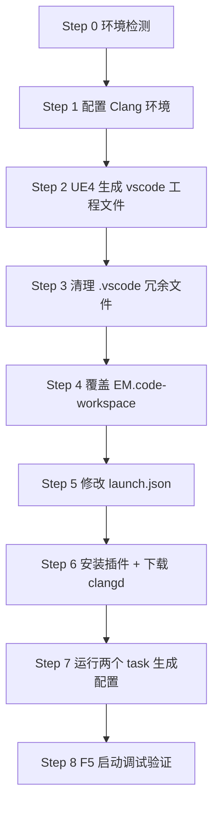

# VSCode + clangd 搭建 UE4 C++ 开发环境（傻瓜式指南）

> **原始文档**：https://herogames.feishu.cn/wiki/INPnwF7TriiU1FkbRZAc7QXKnRh （《VSCode+clangd搭建C++开发环境，轻装上阵！》）
> **参考文献**：[Windows 下使用 Vscode + Clangd 搭建 UE4 开发环境 - satori 的文章 - 知乎](https://zhuanlan.zhihu.com/p/507625365)

## 一、适用场景与原理

### 适用场景
- 电脑内存/CPU 不够用，Visual Studio 或 JetBrains Rider 高占用导致卡顿
- 想要轻量、响应快的 C++ 代码编辑 + 智能提示 + 跳转 + 调试环境
- 想要用 VSCode 原生 Agent 接入大模型辅助 C++ 编程

### 核心原理
| 组件 | 作用 |
|------|------|
| **clangd** | 语言服务器，提供智能提示、定义/声明跳转、补全（依赖 `compile_commands.json`） |
| **compile_commands.json** | 记录每个源文件的编译命令，clangd 据此理解项目（由 UBT `-mode=GenerateClangDatabase` 生成） |
| **UE4 的 .vscode 工程** | 提供 `launch.json`（调试）和 `tasks.json`（构建任务），UE4 自动生成 |
| **msvc** | **编译和 Debug 仍使用 msvc**（UE4 生成的命令对 msvc 高度依赖），clangd 只做编辑辅助 |

> ⚠️ **重要认知**：VSCode+clangd 只作为**代码编辑环境**（提示、跳转、调试入口），实际编译仍走 msvc/UBT。

## 二、前置条件检查（Step 0）

**先做环境检测，再开始搭建。** 逐项确认：

| # | 检查项 | 检测命令（PowerShell） | 通过标准 |
|---|--------|----------------------|---------|
| 1 | Visual Studio 已安装 | `& "${env:ProgramFiles(x86)}\Microsoft Visual Studio\Installer\vswhere.exe" -latest -property installationPath` | 返回 VS 安装路径（如 `C:\Program Files\Microsoft Visual Studio\2022\Community`） |
| 2 | clang 组件已装 | `<VS路径>\VC\Tools\Llvm\bin\clang.exe --version` | 返回 clang 版本信息 |
| 3 | LLVM 软链接 | `Test-Path "C:\Program Files\LLVM\bin\clang.exe"` | `True`（若为 `False` 需执行 Step 1.2） |
| 4 | PATH 含 LLVM | `$env:Path -split ';' | Where-Object {$_ -like '*LLVM*'}` | 输出含 `C:\Program Files\LLVM\bin`（若空需执行 Step 1.3） |
| 5 | VSCode 已安装 | `Get-Command code -ErrorAction SilentlyContinue` | 能定位到 code（若没有则让用户先装 VSCode） |
| 6 | `.uproject` 存在 | 定位项目根目录下的 `*.uproject` 文件 | 能找到（如 `EM.uproject`） |

> 若 1/2 未通过：提示用户在 **Visual Studio Installer → 单个组件 → 搜索 clang → 勾选全部 clang 相关组件** 后安装。没有 VS 的同学需要自行获取 clang。

## 三、搭建步骤总览



---

## Step 1: 配置 Clang 环境

### 1.1 在 Visual Studio Installer 安装 clang 组件
- 打开 Visual Studio Installer → **单个组件** → 搜索 `clang`
- **全勾选** clang 相关组件（C++ Clang tools for Windows 等）
- 安装完成后 clang 位于：`<你的VisualStudio安装目录>\Microsoft Visual Studio\2xxx\Community\VC\Tools\Llvm\bin`

### 1.2 创建 LLVM 软链接（让 UBT 能识别到 LLVM）
> 需管理员权限的终端执行。`{VS_PATH}` 替换为 vswhere 探测到的路径。

```powershell
# 1. 创建文件夹
New-Item -ItemType Directory -Path "C:\Program Files\LLVM" -Force | Out-Null
# 2. 在 LLVM 下建 bin 软链接指向 VS 的 Llvm\bin（cmd 的 mklink 需要管理员）
cmd /c 'mklink /D "C:\Program Files\LLVM\bin" "{VS_PATH}\VC\Tools\Llvm\bin"'
```

**验证**：`Test-Path "C:\Program Files\LLVM\bin\clang.exe"` 返回 `True`。

> 若报"拒绝访问"，请用管理员身份重新打开终端再执行。

### 1.3 把 `C:\Program Files\LLVM\bin` 加入 PATH（让 VSCode 识别 LLVM）
```powershell
# 用户级 PATH 追加（立即生效于当前会话 + 持久化）
$llvmPath = "C:\Program Files\LLVM\bin"
$current = [Environment]::GetEnvironmentVariable("Path", "User")
if ($current -notlike "*$llvmPath*") {
    [Environment]::SetEnvironmentVariable("Path", "$current;$llvmPath", "User")
}
$env:Path += ";$llvmPath"
```

**验证**：新开终端执行 `clang --version` 能输出版本信息。

---

## Step 2: 设置 UE4 的 IDE 为 vscode 并生成工程文件

### 2.1 编辑器设置
1. 用 UE 编辑器打开项目 → `Edit` → `Editor Preferences...`
2. 左侧选 **Source Code** → 右侧 **Source Code Editor** 改为 **Visual Studio Code**

### 2.2 生成工程文件（二选一）
**方式 A（编辑器菜单）**：右键 `.uproject` 文件 → `Generate Visual Studio project files`

**方式 B（命令行）**：
```powershell
# 在引擎根目录执行（{ENGINE_PATH} 为引擎根目录，{UPROJECT_PATH} 为 .uproject 绝对路径）
cd {ENGINE_PATH}
& ".\Engine\Build\BatchFiles\GenerateProjectFiles.bat" -project="{UPROJECT_PATH}" -game -engine
```

### 2.3 生成产物
生成成功后项目根目录会出现：
- `*.code-workspace`（如 `EM.code-workspace`）— 工作区文件
- `.vscode/` — 含 `launch.json`、`tasks.json`、智能提示文件
- `.ignore` — 缩小 VSCode 搜索范围（默认忽略 Lua 脚本，见 Step 6.3）

---

## Step 3: 清理 .vscode 目录（可选但推荐）

UE4 生成的智能提示文件（`compileCommands_Default/`、`compileCommands_EM/` 等）比较拉跨，只提供项目源码提示且 clangd 无法识别，**建议删除，只保留 `launch.json` 和 `tasks.json`**：

```powershell
$vscodeDir = "{EM_ROOT}\.vscode"
Get-ChildItem $vscodeDir | Where-Object { $_.Name -notin @("launch.json", "tasks.json") } | Remove-Item -Recurse -Force
```

> 不删也没啥影响，后面生成的 `compile_commands.json` 会覆盖其作用。

---

## Step 4: 覆盖 `*.code-workspace` 工作区配置

**用下面内容覆盖项目根目录的 `*.code-workspace` 文件**（如 `EM.code-workspace`）。

### 4.1 替换占位符
| 占位符 | 替换为 | 示例 |
|--------|--------|------|
| `{YourUnrealEnginePath}` | 引擎根目录（相对或绝对路径） | `../../unrealengine` 或 `E:\Pan1\unrealengine` |

> 注：文档原版还有 `{YourProjectName}` / `{YourUprojectPath}` 占位符，本模板已内置为 `EM` / `${workspaceFolder}/EM.uproject`；若你的项目名不同，请同步修改 tasks 里的参数。

### 4.2 完整模板

```json
// vscode-clangd-ue.code-workspace
// Author: @MrWen33
//
// 0.  Install Clang and add to your PATH
// 1.  把所有的 {YourUnrealEnginePath} 替换为你的引擎所在目录（相对或绝对路径均可）
// 2.  用 vscode 打开本文件，运行 task "Gen Compile Commands" 和 "Gen Generated Code"
// 3.  enjoy coding!
//
{
    "folders": [
        {
            "name": "EM",
            "path": "."
        },
        {
            "name": "UE4",
            "path": "{YourUnrealEnginePath}"
        }
    ],
    "settings": {
        "typescript.tsc.autoDetect": "off",
        "C_Cpp.intelliSenseEngine": "Disabled",
        "C_Cpp.autocomplete": "Disabled",
        "C_Cpp.errorSquiggles": "Disabled",

        "clangd.arguments": [
            "--compile-commands-dir=.vscode",
            "-pretty",
            "--clang-tidy",
            "-j=12",
            "--header-insertion=never",
            "--all-scopes-completion",
            "--completion-style=detailed",
            "--pch-storage=memory"
        ],
        "dotnet.defaultSolution": "disable"
    },
    "extensions": {
        "recommendations": [
            "ms-vscode.cpptools",
            "ms-dotnettools.csharp",
            "llvm-vs-code-extensions.vscode-clangd"
        ]
    },
    "tasks": {
        "version": "2.0.0",
        "tasks": [
            {
                "label": "Gen Generated Code",
                "group": "none",
                "command": "Engine\\Binaries\\DotNET\\UnrealBuildTool.exe",
                "args": [
                    "EMEditor",
                    "Win64",
                    "DebugGame",
                    "-SkipBuild",
                    "-project=${workspaceFolder}/EM.uproject",
                    "-game",
                    "-engine"
                ],
                "type": "shell",
                "options": {
                    "cwd": "{YourUnrealEnginePath}"
                }
            },
            {
                "label": "Gen Compile Commands",
                "group": "none",
                "dependsOn": ["Subtask:GenClangDatabase", "Subtask:MoveCompileCommands"],
                "dependsOrder": "sequence"
            },
            {
                "label": "Subtask:GenClangDatabase",
                "group": "none",
                "command": "Engine\\Binaries\\DotNET\\UnrealBuildTool.exe",
                "args": [
                    "EMEditor",
                    "Win64",
                    "DebugGame",
                    "-SkipBuild",
                    "-project=${workspaceFolder}/EM.uproject",
                    "-game",
                    "-engine",
                    "-mode=GenerateClangDatabase"
                ],
                "type": "shell",
                "options": {
                    "cwd": "{YourUnrealEnginePath}"
                }
            },
            {
                "label": "Subtask:MoveCompileCommands",
                "group": "none",
                "command": "move",
                "args": [
                    "compile_commands.json",
                    "${workspaceFolder}/.vscode/compile_commands.json"
                ],
                "type": "shell",
                "options": {
                    "cwd": "{YourUnrealEnginePath}"
                }
            }
        ]
    }
}
```

### 4.3 模板说明
| Task 名称 | 作用 |
|-----------|------|
| `Gen Generated Code` | 调用 UHT 生成 UClass 的 `*.generated.h` 代码 |
| `Gen Compile Commands` | 组合下面两个子任务 |
| `Subtask:GenClangDatabase` | UBT 生成 `compile_commands.json`（在引擎目录） |
| `Subtask:MoveCompileCommands` | 把 `compile_commands.json` 移动到 `.vscode/` 下供 clangd 使用 |

### 4.4 关键参数说明
- `clangd.arguments` 中 **`-j=12`** 是 clangd 运行线程数，**推荐等于 CPU 核数**（12 核配 12）。如果 clangd 占用还是太高，可以适当调低（如 `-j=6`）。
- `--compile-commands-dir=.vscode`：指定 clangd 从 `.vscode/` 目录读取 `compile_commands.json`。
- `C_Cpp.*` 三项全部 `Disabled`：禁用微软 C/C++ 插件的 IntelliSense，避免与 clangd 冲突（**关键！**）。

---

## Step 5: 修改 launch.json（可选但推荐）

打开 `.vscode/launch.json`：

1. **把所有 `externalConsole` 选项改为 `false`** — 避免调试引擎时弹出终端黑窗口。
2. （可选）**添加调试启动参数**（如调试 commandlet、连接 UnrealInsight）：
   ```json
   "args": ["-run=ParseSaveGame"]
   ```
3. （可选，Lua 调试）确认 LuaHelper Attach 配置的 `cwd` 指向 Lua 脚本目录：
   ```json
   "cwd": "${workspaceFolder}\\Content\\Script"
   ```

---

## Step 6: 安装插件 + 下载 clangd 语言服务器

### 6.1 安装插件
用 VSCode 打开 `*.code-workspace`，安装以下插件（或 Ctrl+Shift+X 搜索安装）：

| 插件 ID | 作用 |
|---------|------|
| `llvm-vs-code-extensions.vscode-clangd` | clangd 语言服务器客户端（**核心**） |
| `ms-vscode.cpptools` | C/C++ 基础支持 |
| `ms-dotnettools.csharp` | C# 支持（会捆绑 .NET Install Tool，UBT 需要） |
| （可选）`sumneko.lua` / `LuaHelper` / `LuaPanda` | Lua 智能提示 / 调试 |

### 6.2 下载 clangd language server
`Ctrl+P` 打开输入框 → 运行命令：
```
>clangd: Download language server
```
> 等待下载完成。如果下载失败，可改用命令行方式安装：`winget install LLVM.LLVM`（会自带 clangd）。

### 6.3 让 VSCode 能搜索/编辑 Lua 文件（可选）
UE4 生成的 `.ignore` 会排除整个 `Content` 目录，导致搜不到 Lua 脚本。若需要同时编辑 Lua，用支持 Lua 的 `.ignore` 覆盖项目根目录的 `.ignore`（内容要点）：
```
.svn
.vs
.vscode
Binaries
Build
Content/*
!Content/Script
!Content/Tools
Content/Tools/*
!Content/Tools/Python
DerivedDataCache
ExportDatas
Intermediate/*
!Intermediate/Intellisense
output
Saved
Server
...
```
> 核心逻辑：先排除 `Content/*`，再用 `!Content/Script` 等**取反**放行 Lua 相关目录。

---

## Step 7: 生成 compile_commands.json 与 GeneratedCode

`Ctrl+P` → 输入 `task` → 依次运行两个任务：

1. **`Gen Generated Code`** — 生成 UClass 的 GeneratedCode
2. **`Gen Compile Commands`** — 在 `.vscode/` 下生成 `compile_commands.json`

**验证**：`.vscode/compile_commands.json` 文件存在且非空（通常几百 MB 级别，如 451,132 KB）。

> 若任务执行报错，检查：① `.code-workspace` 里 `{YourUnrealEnginePath}` 是否已替换；② `C:\Program Files\LLVM\bin` 是否存在且 clang.exe 可执行；③ 是否以管理员权限完成 Step 1.2 软链接。

---

## Step 8: 验证环境（F5 启动调试）

1. 打开任意 `.h`/`.cpp` 文件，确认 clangd 状态栏出现（无报错图标）
2. Debug 面板切换到 **`EMEditor (Development) (EM)`** 选项
3. 按 **F5** 启动引擎调试
4. 验证项：
   - ✅ 断点能命中（有调用堆栈、可监视变量）
   - ✅ 定义/声明跳转（F12/Alt+F12）精确
   - ✅ 成员提示、智能补全、U++ 宏（UPROPERTY/UFUNCTION 等）可识别
   - ✅ 终端窗口显示编译日志，调试控制台显示 UE4 日志
   - ✅ 终止调试能秒关编辑器

---

## 常见问题排查（FAQ）

| 问题 | 原因 | 解决 |
|------|------|------|
| clangd 报错找不到头文件 | `compile_commands.json` 未生成或位置不对 | 确认 Step 7 已运行；检查 `.code-workspace` 的 `--compile-commands-dir=.vscode` |
| 多重 include 识别不出 | clangd 对多层 include 不太智能 | **显式写出**该 include 头文件即可消除报错（编译仍能通过） |
| 编译期间右下角弹窗 | 编译进行中 | **不要点击任何选项**（会打断编译），等编译结束自动消失 |
| clangd 占用过高 | `-j` 线程数太多 | 调低 `-j`（如 12 → 6） |
| 工程里搜不到 Lua 文件 | `.ignore` 排除了 Content | 用 Step 6.3 的 `.ignore` 覆盖 |
| 任务执行报错 | 路径/权限问题 | 检查占位符替换、LLVM 软链接、管理员权限 |
| 修改配置后不生效 | 没重载窗口 | Ctrl+Shift+P → `Developer: Reload Window` |

---

## ⚠️ 重要注意事项（务必告知用户）

1. **搭建完成后不要轻易重新生成工程文件！** UE4 生成的东西会轻易覆盖掉你设置的东西（`.code-workspace`、`.vscode`、`.ignore` 全会被重置）。
2. **编译仍用 msvc**：clangd 只提供编辑体验，不要指望它替代编译链路。
3. **VSCode 1.122+ 才支持原生 Agent**，如需接入大模型请确认版本。
4. 编辑体验：Rider > VSCode > VisualStudio；低占用：VSCode 最强。配置过程较折腾，属"邪修"，但一劳永逸。
5. **首次使用会触发 clangd index**（非搭建步骤，是正常现象）：打开任意 `.h`/`.cpp` 会开始索引，在 `.vscode/` 下生成 `.cache` 缓存。整个源码（含引擎）索引约需 **3-4 小时**（源码引擎更久），期间占用大量 CPU/内存（如 VSCode 69.8% CPU / 11.88GB 内存），属正常；可**关闭 VSCode 后继续**，索引完成占用即大幅下降，后续代码更新只触发少量增量 index。建议在**空闲时段**触发（如下班前打开工程）。

---

## 参考资源

- 飞书原文档：https://herogames.feishu.cn/wiki/INPnwF7TriiU1FkbRZAc7QXKnRh
- 知乎教程：https://zhuanlan.zhihu.com/p/507625365
- clangd 扩展：https://marketplace.visualstudio.com/items?itemName=llvm-vs-code-extensions.vscode-clangd
